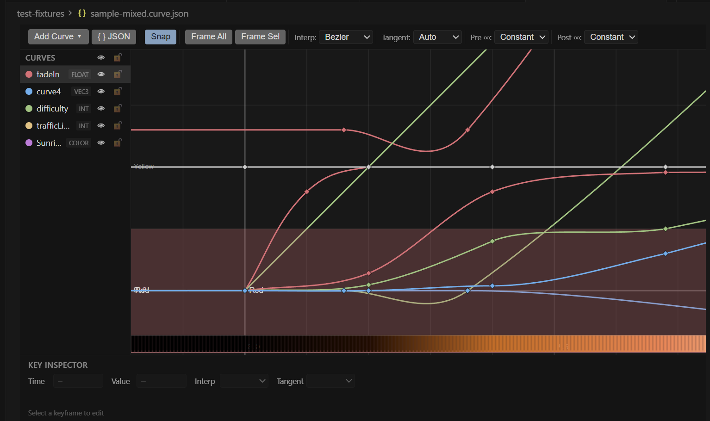

# Curve Editor — VS Code Extension

A visual curve editor for `.curve.json` files. Define animation curves, parameter envelopes, and state timelines using keyframes with bezier, linear, or constant interpolation — similar to Unreal Engine's curve editor.



- Install from the [VS Code Marketplace](https://marketplace.visualstudio.com/items?itemName=TinyMooshGamesInc.curve-editor)
- Runtime evaluation libraries: [`curve-eval` on npm](https://www.npmjs.com/package/curve-eval) and [`curve-eval` on PyPI](https://pypi.org/project/curve-eval/)

## Features

- **Visual curve editing** — Canvas-based editor with grid, pan, zoom, and keyframe manipulation
- **Multiple curve types** — Float, Int, Vec2, Vec3, Vec4, Color
- **Bezier interpolation** — Full tangent handle control with Auto, User, Break, and Aligned modes
- **State curves** — Discrete integer states rendered as Gantt-style colored bands with labels
- **Color gradient preview** — Real-time color strip for color curves
- **Per-component editing** — Vec and color curves show individual sub-curves with solo/hide
- **Infinity modes** — Constant, Linear, Cycle, Oscillate pre/post extrapolation
- **Native undo/redo** — Edits go through VS Code's TextDocument stack
- **Theme-aware** — Inherits colors from your active VS Code theme
- **JSON validation** — Ships a JSON Schema for autocomplete and validation in text editors
- **Runtime libraries** — Standalone JS and Python packages for evaluating curves in your projects

## File Format

Files use the `.curve.json` extension:

```json
{
  "version": 1,
  "curves": [
    {
      "name": "fadeIn",
      "type": "float",
      "preInfinity": "constant",
      "postInfinity": "constant",
      "keys": [
        { "time": 0.0, "value": 0.0, "interp": "bezier", "tangentMode": "auto" },
        { "time": 1.0, "value": 1.0, "interp": "bezier", "tangentMode": "auto" }
      ]
    }
  ]
}
```

## Keyboard Shortcuts

| Shortcut | Action |
|----------|--------|
| `1` / `2` / `3` | Set interpolation: Constant / Linear / Bezier |
| `S` | Toggle snap to grid |
| `T` | Toggle tangent handle display |
| `F` | Frame selected keys |
| `Home` | Frame all curves |
| `Delete` | Delete selected keys |
| `Ctrl+D` | Duplicate selected keys |
| `Ctrl+A` | Select all keys on visible curves |
| `Ctrl+C` / `Ctrl+V` | Copy / Paste keys |
| Middle mouse drag | Pan viewport |
| Scroll wheel | Zoom |
| Shift + scroll | Horizontal zoom only |
| Ctrl + scroll | Vertical zoom only |
| Double-click canvas | Add key at position |

## Runtime Libraries

### JavaScript (`curve-eval`)

```js
import { evaluate, evaluateAll, evaluateState } from 'curve-eval';

const file = JSON.parse(fs.readFileSync('anim.curve.json', 'utf8'));
const opacity = evaluate(file, 'fadeIn', 2.5);
const frame = evaluateAll(file, 3.0);
const light = evaluateState(file, 'trafficLight', 6.0);
```

### Python (`curve_eval`)

```python
from curve_eval import evaluate, evaluate_all, evaluate_state
import json

with open('anim.curve.json') as f:
    file = json.load(f)

opacity = evaluate(file, 'fadeIn', 2.5)
frame = evaluate_all(file, 3.0)
light = evaluate_state(file, 'trafficLight', 6.0)
```

## Project Structure

```
curve-editor/
├── extension/          # VS Code extension
│   ├── src/            # Extension host (TypeScript)
│   ├── webview/        # Webview UI (vanilla TS + Canvas)
│   └── dist/           # Built output
├── packages/
│   ├── curve-eval-js/  # JavaScript evaluation library
│   └── curve-eval-py/  # Python evaluation library
└── test-fixtures/      # Shared test data
```

## Building

```bash
# Extension
cd extension && npm install && npm run build

# JS library
cd packages/curve-eval-js && npm install && node build.mjs

# JS tests
cd packages/curve-eval-js && npx jest

# Python tests
cd packages/curve-eval-py && python -m pytest tests/ -v
```

## Settings

| Setting | Default | Description |
|---------|---------|-------------|
| `curveEditor.snapTimeInterval` | 0.1 | Time snap increment |
| `curveEditor.snapValueInterval` | 0.1 | Value snap increment |
| `curveEditor.defaultInterpolation` | bezier | Default interp for new keys |
| `curveEditor.defaultTangentMode` | auto | Default tangent mode |
| `curveEditor.showGridLabels` | true | Show axis labels |
| `curveEditor.curveLineWidth` | 2 | Curve line thickness |
| `curveEditor.antiAlias` | true | Canvas anti-aliasing |

## Publishing a New Version

All three packages ship in lockstep — one shared version number across the extension, npm package, and PyPI package. Use the publish script at the repo root:

```powershell
# Patch bump (e.g. 0.1.1 -> 0.1.2), full publish to all three registries
.\publish-all.ps1

# Other bump types
.\publish-all.ps1 -Bump minor        # 0.1.2 -> 0.2.0
.\publish-all.ps1 -Bump major        # 0.1.2 -> 1.0.0
.\publish-all.ps1 -Version 1.2.3     # explicit

# Skip pieces when not needed
.\publish-all.ps1 -SkipTests
.\publish-all.ps1 -SkipJs -SkipPy    # extension-only release
.\publish-all.ps1 -DryRun            # print what would happen
```

The script:

1. Verifies git is clean
2. Bumps version in `extension/package.json`, `packages/curve-eval-js/package.json`, and `packages/curve-eval-py/pyproject.toml`
3. Runs JS + Python test suites
4. Builds the JS library, extension bundle, and Python distributions
5. Publishes to npm, PyPI, and the VS Code Marketplace
6. Commits the version bump, tags `vX.Y.Z`, and pushes to origin

Prerequisites (one-time, already done on your machine):

- `npm login` (or a token in npm config)
- `~/.pypirc` with a PyPI API token
- `vsce login TinyMooshGamesInc` with a Marketplace PAT

## License

MIT — Glen Rhodes / Tiny Moosh Games Inc.
